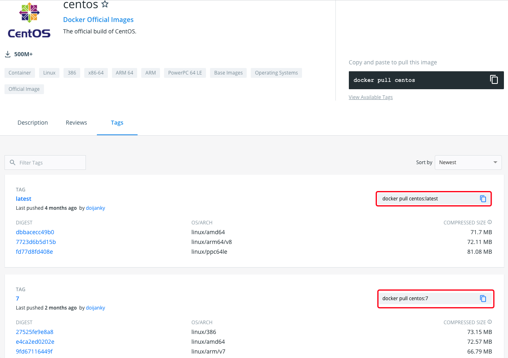

### 核心概念

**Docker 镜像**：一个面向 Docker 引擎的只读模板（一个镜像可以包含一个完整的 Ubuntu，称为 Ubuntu 镜像）

**Docker 容器**：容器是从镜像创建的应用运行实例，可以将其启动、开始、停止、删除，容器都是相互隔离，互不相见的

**Docker 仓库**：

1. Docker 集中存放镜像文件的场所。
2. Docker 仓库可以分为公开仓库和私有仓库

**仓库和注册服务器的区别**：


### Docker 安装

CentOS 7 安装

```sh
yum install -y docker
```

验证

```shell
docker -v
```

### 镜像

Docker 运行容器前需要本地存在对应的镜像，如果本地不存在镜像，Docker 会尝试先从默认镜像仓库下载（默认使用的 Docker Hub），也可以通过配置使用自定义的镜像仓库

#### 获取镜像

命令格式如下，若不显示的指定 TAG，默认会在下载仓库中选择最新版本的镜像

```shell
docker pull NAME[:TAG]
```

**案例演示**：下载一个最新到 CentOS 镜像

进入 https://hub.docker.com/_/centos?tab=tags 可以查看 Docker Hub 中可用的镜像，若不指定标签则是下载 lastest。



案例演示下载 CentOS 7

```shell
# 如下两条命令作用相同，因为默认就是从 registry.hub.docker.com 注册服务器中下载，若需要修改为其他的注册服务器，则将第二条命令的注册服务器的地址修改即可
docker pull centos:7
docker pull registry.hub.docker.com/centos:7
```

#### 查看镜像信息

命令：

```shell
docker images
```

结果说明：

```shell
REPOSITORY          TAG                 IMAGE ID            CREATED             SIZE
docker.io/centos    7                   8652b9f0cb4c        4 months ago        204 MB
```

- REPOSITORY：来源于哪个仓库，该案例来自于 centos 库

- TAG：镜像标签信息，例如该案例是 7

- IMAGE ID：镜像的唯一标识

- CREATED：镜像的创建时间

- SIZE：镜像的大小

**本地镜像新增标签：新增 `centos:lastest` 镜像标签**

查看现有镜像

```shell
REPOSITORY          TAG                 IMAGE ID            CREATED             SIZE
docker.io/centos    7                   8652b9f0cb4c        4 months ago        204 MB
```

新增镜像标签

```shell
docker tag docker.io/centos:7 centos:lastest
```

查看现有镜像

```shell
REPOSITORY          TAG                 IMAGE ID            CREATED             SIZE
centos              lastest             8652b9f0cb4c        4 months ago        204 MB
docker.io/centos    7                   8652b9f0cb4c        4 months ago        204 MB
```

对比两次镜像信息的记过，发现镜像 ID 是完全一致的，说明实际上指向了同一个镜像只是别名不同，所以标签在这里起到了引用或快捷方式的作用

**查看镜像的详细信息**

```shell
docker inspect 镜像id
```

该命令返回的是一个 JSON 格式的数据，若我们只需要其中的某一项可以用 `-f` 参数来指定

```shell
# 获取 Architecture 信息
docker inspect -f {{".Architecture"}} 镜像id
```

#### 搜寻镜像

以下命令可以搜索远程仓库中共享的镜像，默认搜索 Docker Hub 官方仓库中的镜像

```shell
docker search [参数] 应用名
```

参数说明

| 参数              | 说明                               |
| ----------------- | ---------------------------------- |
| --automated=false | 仅显示自动创建的镜像               |
| --no-trunc=false  | 输出信息不截断显示                 |
| -s, --starts=0    | 指定仅显示评价为指定星级以上的镜像 |

实例：搜索 mysql 相关镜像

```shell
[root@VM-0-14-centos ~]# docker search mysql
INDEX       NAME                                        DESCRIPTION                                     STARS     OFFICIAL   AUTOMATED
docker.io   docker.io/mysql                             MySQL is a widely used, open-source relati...   10676     [OK]       
docker.io   docker.io/mariadb                           MariaDB Server is a high performing open s...   4010      [OK]       
docker.io   docker.io/mysql/mysql-server                Optimized MySQL Server Docker images. Crea...   780                  [OK]
docker.io   docker.io/percona                           Percona Server is a fork of the MySQL rela...   529       [OK]       
docker.io   docker.io/centos/mysql-57-centos7           MySQL 5.7 SQL database server                   87                   
docker.io   docker.io/mysql/mysql-cluster               Experimental MySQL Cluster Docker images. ...   80                   
docker.io   docker.io/centurylink/mysql                 Image containing mysql. Optimized to be li...   59                   [OK]
docker.io   docker.io/bitnami/mysql                     Bitnami MySQL Docker Image                      50                   [OK]
```

输出信息包括镜像名、描述、星级（镜像的欢迎程度）、是否官方发布、是否自动构建等信息。结果是按照星级评价进行排序，AUTOMATED 资源是允许用户验证镜像的来源和内容

#### 删除镜像

```shell
# IMAGE 可以是标签也可以是镜像 ID
docker rmi IMAGE [IMAGE...]
```

**使用标签删除**

若某一镜像存在多个标签，那么只是删除指定的标签，不会影响镜像文件。

删除上文中新增的 centos:lastest

```shell
docker rmi centos:lastest

结果：
[root@VM-0-14-centos ~]# docker rmi centos:lastest 
Untagged: centos:lastest
Untagged: docker.io/centos@sha256:0f4ec88e21daf75124b8a9e5ca03c37a5e937e0e108a255d890492430789b60e
```

若当前镜像只存在一个标签时，则会彻底删除该镜像

彻底删除 centos:7

```shell
docker rmi docker.io/centos:7 

[root@VM-0-14-centos ~]# docker rmi docker.io/centos:7 
Untagged: docker.io/centos:7
Deleted: sha256:8652b9f0cb4c0599575e5a003f5906876e10c1ceb2ab9fe1786712dac14a50cf
Deleted: sha256:174f5685490326fc0a1c0f5570b8663732189b327007e47ff13d2ca59673db02
```

**使用镜像 id 删除**

若存在指向镜像的标签，那么会先删除镜像的所有标签，然后删除镜像文件本身。

当镜像创建的容器存在的时候，镜像文件默认无法删除。若要强制删除则可以使用 `docker rmi -f IMAGE [IMAGE..]`（不推荐使用，若强制删除会将该镜像换一个新的 ID 存放在系统中）

实例：删除 centos:7

```shell
docker rmi 300e315adb2f

[root@VM-0-14-centos ~]# docker rmi 300e315adb2f
Untagged: docker.io/centos:latest
Untagged: docker.io/centos@sha256:5528e8b1b1719d34604c87e11dcd1c0a20bedf46e83b5632cdeac91b8c04efc1
Deleted: sha256:300e315adb2f96afe5f0b2780b87f28ae95231fe3bdd1e16b9ba606307728f55
Deleted: sha256:2653d992f4ef2bfd27f94db643815aa567240c37732cae1405ad1c1309ee9859
```

#### 创建镜像

**基于已有镜像的容器创建**

基本命令

```shell
docker commit [OPTIONS] CONTAINER [REPOSITORY[:TAG]]
```

`OPTIONS` 参数说明

| 参数             | 说明               |
| ---------------- | ------------------ |
| -a, --author=""  | 作者信息           |
| -m, --message="" | 提交信息           |
| -p, --pause=true | 提交时暂停容器运行 |

**实际：创建一个新的镜像**

启动一个 mysql 镜像

```shell
docker run -ti mysql /bin/bash
```

获取容器 ID

```shell
# @后的 7e360727c953 就是容器 id
root@7e360727c953:/#
```

创建新的镜像，提交时候可以使用 ID 或名称来指定容器

```shell
docker commit -m "Add a new file" -a "Docker Newbee" 7e360727c953 test
```

执行上述命令后，若成功则会返回新创建的镜像 ID

```shell
sha256:1656bc6990b0650adce31b664dd3e423b80f000f6df412fce5a3781687d0526e
```

查看本地镜像则会发现新创的镜像存在

```shell
[root@VM-0-14-centos ~]# docker images
REPOSITORY          TAG                 IMAGE ID            CREATED             SIZE
test                latest              1656bc6990b0        10 seconds ago      546 MB
docker.io/mysql     latest              e646c6533b0b        4 hours ago         546 MB
```

**基于本地模板导入**

需要先下载模板文件，再使用如下命令导入

```shell
cat 文件名.tar.gz | docker import - NAME:TAG
```

#### 存出和载入镜像

**存储镜像**

使用命令：`docker save -o 输出文件 镜像标签`

实例：存出本地的 mysql:lastest 镜像为 mysql_lastest.tar

```shell
docker save -o mysql_latest.tar docker.io/mysql:latest
```

**载入镜像**

可以将存出的本地文件导入到本地镜像库

```shell
docker load --input 存出的文件
docker load < 存出文件
```

实例：加上面存出的 mysql 重新导入

```shell
docker load --input mysql_latest.tar

[root@VM-0-14-centos ~]# docker load --input mysql_latest.tar 
Loaded image: docker.io/mysql:latest
```

#### 上传镜像

可以上传镜像到仓库，默认上传到官方仓库

```shell
docker push NAME[:TAG]
```

实例：上传 mysql 镜像到仓库

```shell
docker push docker.io/mysql:latest
```


