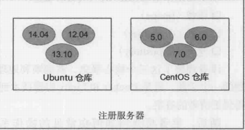
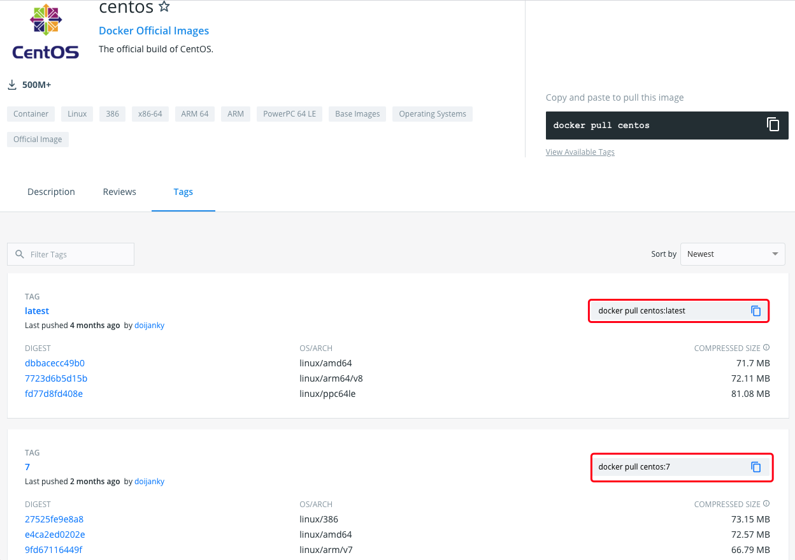

### 核心概念

**Docker 镜像**：一个面向 Docker 引擎的只读模板（一个镜像可以包含一个完整的 Ubuntu，称为 Ubuntu 镜像）

**Docker 容器**：容器是从镜像创建的应用运行实例，可以将其启动、开始、停止、删除，容器都是相互隔离，互不相见的

**Docker 仓库**：

1. Docker 集中存放镜像文件的场所。
2. Docker 仓库可以分为公开仓库和私有仓库

**仓库和注册服务器的区别**：



### Docker 安装

CentOS 7 安装

```sh
yum install -y docker
```

验证

```shell
docker -v
```

### 镜像

Docker 运行容器前需要本地存在对应的镜像，如果本地不存在镜像，Docker 会尝试先从默认镜像仓库下载（默认使用的 Docker Hub），也可以通过配置使用自定义的镜像仓库

#### 获取镜像

命令格式如下，若不显示的指定 TAG，默认会在下载仓库中选择最新版本的镜像

```shell
docker pull NAME[:TAG]
```

**案例演示**：下载一个最新到 CentOS 镜像

进入 https://hub.docker.com/_/centos?tab=tags 可以查看 Docker Hub 中可用的镜像，若不指定标签则是下载 lastest。



案例演示下载 CentOS 7

```shell
# 如下两条命令作用相同，因为默认就是从 registry.hub.docker.com 注册服务器中下载，若需要修改为其他的注册服务器，则将第二条命令的注册服务器的地址修改即可
docker pull centos:7
docker pull registry.hub.docker.com/centos:7
```

#### 查看镜像信息

命令：

```shell
docker images
```

结果说明：

```shell
REPOSITORY          TAG                 IMAGE ID            CREATED             SIZE
docker.io/centos    7                   8652b9f0cb4c        4 months ago        204 MB
```

- REPOSITORY：来源于哪个仓库，该案例来自于 centos 库

- TAG：镜像标签信息，例如该案例是 7

- IMAGE ID：镜像的唯一标识

- CREATED：镜像的创建时间

- SIZE：镜像的大小

**本地镜像新增标签：新增 `centos:lastest` 镜像标签**

查看现有镜像

```shell
REPOSITORY          TAG                 IMAGE ID            CREATED             SIZE
docker.io/centos    7                   8652b9f0cb4c        4 months ago        204 MB
```

新增镜像标签

```shell
docker tag docker.io/centos:7 centos:lastest
```

查看现有镜像

```shell
REPOSITORY          TAG                 IMAGE ID            CREATED             SIZE
centos              lastest             8652b9f0cb4c        4 months ago        204 MB
docker.io/centos    7                   8652b9f0cb4c        4 months ago        204 MB
```

对比两次镜像信息的记过，发现镜像 ID 是完全一致的，说明实际上指向了同一个镜像只是别名不同，所以标签在这里起到了引用或快捷方式的作用

**查看镜像的详细信息**

```shell
docker inspect 镜像id
```

该命令返回的是一个 JSON 格式的数据，若我们只需要其中的某一项可以用 `-f` 参数来指定

```shell
# 获取 Architecture 信息
docker inspect -f {{".Architecture"}} 镜像id
```

#### 搜寻镜像

以下命令可以搜索远程仓库中共享的镜像，默认搜索 Docker Hub 官方仓库中的镜像

```shell
docker search [参数] 应用名
```

参数说明

| 参数              | 说明                               |
| ----------------- | ---------------------------------- |
| --automated=false | 仅显示自动创建的镜像               |
| --no-trunc=false  | 输出信息不截断显示                 |
| -s, --starts=0    | 指定仅显示评价为指定星级以上的镜像 |

实例：搜索 mysql 相关镜像

```shell
[root@VM-0-14-centos ~]# docker search mysql
INDEX       NAME                                        DESCRIPTION                                     STARS     OFFICIAL   AUTOMATED
docker.io   docker.io/mysql                             MySQL is a widely used, open-source relati...   10676     [OK]       
docker.io   docker.io/mariadb                           MariaDB Server is a high performing open s...   4010      [OK]       
docker.io   docker.io/mysql/mysql-server                Optimized MySQL Server Docker images. Crea...   780                  [OK]
docker.io   docker.io/percona                           Percona Server is a fork of the MySQL rela...   529       [OK]       
docker.io   docker.io/centos/mysql-57-centos7           MySQL 5.7 SQL database server                   87                   
docker.io   docker.io/mysql/mysql-cluster               Experimental MySQL Cluster Docker images. ...   80                   
docker.io   docker.io/centurylink/mysql                 Image containing mysql. Optimized to be li...   59                   [OK]
docker.io   docker.io/bitnami/mysql                     Bitnami MySQL Docker Image                      50                   [OK]
```

输出信息包括镜像名、描述、星级（镜像的欢迎程度）、是否官方发布、是否自动构建等信息。结果是按照星级评价进行排序，AUTOMATED 资源是允许用户验证镜像的来源和内容

#### 删除镜像

```shell
# IMAGE 可以是标签也可以是镜像 ID
docker rmi IMAGE [IMAGE...]
```

**使用标签删除**

若某一镜像存在多个标签，那么只是删除指定的标签，不会影响镜像文件。

删除上文中新增的 centos:lastest

```shell
docker rmi centos:lastest

结果：
[root@VM-0-14-centos ~]# docker rmi centos:lastest 
Untagged: centos:lastest
Untagged: docker.io/centos@sha256:0f4ec88e21daf75124b8a9e5ca03c37a5e937e0e108a255d890492430789b60e
```

若当前镜像只存在一个标签时，则会彻底删除该镜像

彻底删除 centos:7

```shell
docker rmi docker.io/centos:7 

[root@VM-0-14-centos ~]# docker rmi docker.io/centos:7 
Untagged: docker.io/centos:7
Deleted: sha256:8652b9f0cb4c0599575e5a003f5906876e10c1ceb2ab9fe1786712dac14a50cf
Deleted: sha256:174f5685490326fc0a1c0f5570b8663732189b327007e47ff13d2ca59673db02
```

**使用镜像 id 删除**

若存在指向镜像的标签，那么会先删除镜像的所有标签，然后删除镜像文件本身。

当镜像创建的容器存在的时候，镜像文件默认无法删除。若要强制删除则可以使用 `docker rmi -f IMAGE [IMAGE..]`（不推荐使用，若强制删除会将该镜像换一个新的 ID 存放在系统中）

实例：删除 centos:7

```shell
docker rmi 300e315adb2f

[root@VM-0-14-centos ~]# docker rmi 300e315adb2f
Untagged: docker.io/centos:latest
Untagged: docker.io/centos@sha256:5528e8b1b1719d34604c87e11dcd1c0a20bedf46e83b5632cdeac91b8c04efc1
Deleted: sha256:300e315adb2f96afe5f0b2780b87f28ae95231fe3bdd1e16b9ba606307728f55
Deleted: sha256:2653d992f4ef2bfd27f94db643815aa567240c37732cae1405ad1c1309ee9859
```

#### 创建镜像

##### 基于已有镜像的容器创建

**基本命令**

```shell
docker commit [OPTIONS] CONTAINER [REPOSITORY[:TAG]]
```

**`OPTIONS` 参数说明**

| 参数             | 说明               |
| ---------------- | ------------------ |
| -a, --author=""  | 作者信息           |
| -m, --message="" | 提交信息           |
| -p, --pause=true | 提交时暂停容器运行 |

**实际：创建一个新的镜像**

启动一个 mysql 镜像

```shell
docker run -ti mysql /bin/bash
```

获取容器 ID

```shell
# @后的 7e360727c953 就是容器 id
root@7e360727c953:/#
```

创建新的镜像，提交时候可以使用 ID 或名称来指定容器

```shell
docker commit -m "Add a new file" -a "Docker Newbee" 7e360727c953 test
```

执行上述命令后，若成功则会返回新创建的镜像 ID

```shell
sha256:1656bc6990b0650adce31b664dd3e423b80f000f6df412fce5a3781687d0526e
```

查看本地镜像则会发现新创的镜像存在

```shell
[root@VM-0-14-centos ~]# docker images
REPOSITORY          TAG                 IMAGE ID            CREATED             SIZE
test                latest              1656bc6990b0        10 seconds ago      546 MB
docker.io/mysql     latest              e646c6533b0b        4 hours ago         546 MB
```

##### 基于本地模板导入

需要先下载模板文件，再使用如下命令导入

```shell
cat 文件名.tar.gz | docker import - NAME:TAG
```

##### Dockerfile 创建镜像

###### 基本结构

- 镜像基础信息
- 维护者信息
- 镜像操作指令
- 容器启动时执行指令

```shell
# 第一行必须指定基于的基础镜像
FROM ubuntu
# 维护者信息
MAINTAINER docker_user docker_user@email.com
# 镜像的操作指令
RUN echo "deb http://archive.ubuntu.com/ubuntu/ raring main universe" /etcl apt/sources.list
RUN apt-get update && apt-get install -y nginx RUN echo"\ndaemon off;">>/etc/nginx/nginx.conf
# 容器启动时执行指令
CMD /usr/sbin/nginx
```

###### 指令

**FROM**

格式：`FROM IMAGE 或 FROM IMAGE:TAG`

第一条指令必须是 FROM 指令，如果一个 Dockerfile 中创建多个镜像时，可以使用多个 FROM 指令

**MAINTAINER**

格式为`MAINTAINER NAME`，指定维护者信息

**RUN**

格式为 `RUN <command>` 或 `RUN ["executable", "param1", "param2"]`

前者将在 shell 终端中运行命令，后者使用 exec 执行

**CMD**

格式为:

1. `CMD ["executable", "param1", "param2"]`：使用 exec 执行
2. `CMD command param1 param2`：在 /bin/bash 中执行，提供给需要交互的作用
3. `CMD ["param1", "param2"]`：提供给 ENTRYPOINT 的默认参数

指定启动容器执行的命令，每个 Dockerfile 只能有一条 CMD，指定多了会执行最后一条

**EXPOSE**

格式为 `EXPOSE <port> [<port>...]`，告诉 Docker 服务端容器暴露的端口号，供互联网使用

**ENV**

格式为 `ENV <key> <value>`，指定一个环境变量，会被后续 RUN 指令使用，并在容器运行时保持

**ADD**

格式为 `ADD <src> <dest>`，复制指定的 `<src>` 到容器中的 `<dest>`

`<scr>` 可以是 Dockerfile 所在目录中的一个相对路径（文件或目录）；也可以是一个 URL；还可以是一个 tar 文件（自动解压为目录）

**COPY**

格式为 `COPY <src> <dest>`，复制本地主机的 `<src>` （为 Dockfile 所在目录的相对路径，文件过目录）为容器中的 `<dest>`

目标路径不存在时，会自动创建。

**ENTRYPOINT**

格式为

1. `ENTRYPOINT[ "executable", "param1", "param2"]` 
2. `ENTRYPOINT command paraml param2` (shell 中执行)

配置容器启动后执行的命令，并且不可被docker run提供的参数覆盖。每个Dockerfile中只能有一个ENTRYPOINT，当指定多个ENTRYPOINT时，只有最后一个生效。

**VOLUME**

格式为 `VOLUME [ "/data"]`，创建一个可以从本地主机或其他容器挂载的挂载点，一般用来存放数据库和需要保持的数据等。

**USER**

格式为 `USER daemon`

指定运行容器时的用户名或 UID，后续的 RUN 也会使用指定用户

**WORKDIR**

格式为 `WORKDIR /path/to/workdir`
为后续的`RUN、CMD、ENTRYPOINT` 指令配置工作目录。
可以使用多个  WORKDIR 指令，后续命令如果参数是相对路径，则会基于之前命令指定的路径

**ONBUILD**

格式为 `ONBUILD [INSTRUCTION]`
配置当所创建的镜像作为其他新创建镜像的基础镜像时，所执行的操作指令

###### 创建镜像

命令格式

```shell
docker build [OPTIONS] PATH | URL
```

该命令将读取指定路径下(包括子目录)的Dockerfile，并将该路径下所有内容发送给Docker服务端，由服务端来创建镜像。因此一般建议放置Dockerfile的目录为空目录。可以通过.dockerignore文件(每一行添加一条匹配模式) 来让Docker忽略路径下的目录和文件。

实例：生成指定标签信息的镜像

```shell
# -t：指定镜像的标签信息
# /tmp/docker_builder/  docker 文件所在目录
docker build -t build_repo/first__image /tmp/docker_builder/
```

#### 存出和载入镜像

**存储镜像**

使用命令：`docker save -o 输出文件 镜像标签`

实例：存出本地的 mysql:lastest 镜像为 mysql_lastest.tar

```shell
docker save -o mysql_latest.tar docker.io/mysql:latest
```

**载入镜像**

可以将存出的本地文件导入到本地镜像库

```shell
docker load --input 存出的文件
docker load < 存出文件
```

载入镜像也可以使用 `docker import`，但这是导入一个容器快照到本地镜像库，快照文件会丢弃所有的历史记录和元数据信息，而 `docker load` 是导入镜像存储文件到本地镜像库，会完成保存记录

实例：加上面存出的 mysql 重新导入

```shell
docker load --input mysql_latest.tar

[root@VM-0-14-centos ~]# docker load --input mysql_latest.tar 
Loaded image: docker.io/mysql:latest
```

#### 上传镜像

可以上传镜像到仓库，默认上传到官方仓库

```shell
docker push NAME[:TAG]
```

实例：上传 mysql 镜像到仓库

```shell
docker push docker.io/mysql:latest
```

### 容器

#### 创建容器

**新建容器**

使用如下命令新建的容器处于停止状态

```shell
docker create [OPTIONS] IMAGE [命令] [参数...]
```

常用参数列表

| 参数 | 作用                                          |
| ---- | --------------------------------------------- |
| -t   | Docker 分配一个伪终端并绑定到容器的标准输入上 |
| -i   | 让容器的标准输入保持打开                      |

实例：创建一个 centos:7 的容器

```shell
docker create -it centos:7
```

查看容器列表

```shell
docker ps -a

CONTAINER ID        IMAGE               COMMAND                  CREATED             STATUS                    PORTS               NAMES
c13dced07d8c        centos:7            "/bin/bash"              28 minutes ago      Created                                       lucid_beaver
7e360727c953        mysql               "docker-entrypoint..."   16 hours ago        Exited (0) 16 hours ago                       xenodochial_kirch
```

由于容器是停止状态，若需要启动则需要使用如下命令

```sh
docker run [OPTIONS] IMAGE [COMMAND] [ARG...]
```

实例：启动上述创建的 centos:7 容器

```shell
docker start c13dced07d8c
```

注意若在创建容器时没有加 `-it` 参数，则使用 `docker ps` 时查看不到正在运行的容器，这是由于启动后若没有操作则会被杀掉

```shell
[root@VM-0-14-centos ~]# docker ps
CONTAINER ID        IMAGE               COMMAND             CREATED             STATUS              PORTS               NAMES
e60a12a43c6a        centos:7            "/bin/bash"         4 minutes ago       Up 4 minutes                            boring_euclid
d046c69f851c        centos:7            "/bin/bash"         4 minutes ago       Up 4 minutes                            boring_rosalind
```

**新建并启动容器**

启动容器主要是两种方式，一种是基于镜像新建一个容器并启动，另一个则是将终止状态的容器重新启动

命令格式如下：

```shell
docker run [OPTIONS] IMAGE [COMMAND] [ARG...]
```

| 参数 | 作用                                          |
| ---- | --------------------------------------------- |
| -t   | Docker 分配一个伪终端并绑定到容器的标准输入上 |
| -i   | 让容器的标准输入保持打开                      |
| -d   | 容器在后台以守护态的方式运行                  |

当用该命令时，后台会有如下操作：

1. 检查本地是否存在指定镜像，不存在就从公有仓库下载
2. 利用镜像创建并启动一个容器
3. 分配一个文件系统，并在只读的镜像层外面挂载一层可读写层
4. 从宿主主机配置的网桥接口中桥接一个虚拟接口到容器中去
5. 从地址池配置一个 IP 地址给容器
6. 执行用户指定的应用程序
7. 执行完毕后容器被终止

**实例：启动一个 centos 容器并启动 bash 终端**

```shell
docker run -it centos:7 /bin/bash
```

在该命令后会进入交互模式，用户可以通过所创建的终端来输入命令，例如 `ls、ps` 等

若退出容器则可以使用 `ctrl + d` 或 输入 `exit` 来退出容器，退出容器后该容器自动处于终止状态

**实例：启动 centos 容器并后台运行**

```shell
docker run -d centos:7
```

若是容器有输出信息的存在，那么可以使用 `docker logs [OPTIONS] CONTAINER` 查看

#### 终止容器

**停止容器**

使用如下命令首先会向容器发生 SIGTERM 信号，等待一段时间后（默认10秒钟，可以使用 `-t=时间数` 参数进行设置），然后再发生 SIGKILL 信号终止容器。若 Docker 容器中指定的应用终结时，容器也将自动终止

```shell
docker stop [OPTIONS] CONTAINER [CONTAINER...]
```

**实例：停止 centos:7 容器**

查询系统中启动的容器

```shell
[root@VM-0-14-centos ~]# docker ps
CONTAINER ID        IMAGE               COMMAND             CREATED             STATUS              PORTS               NAMES
db6988c79c79        centos:7            "/bin/bash"         45 minutes ago      Up 45 minutes                           awesome_babbage
e60a12a43c6a        centos:7            "/bin/bash"         53 minutes ago      Up 53 minutes                           boring_euclid
d046c69f851c        centos:7            "/bin/bash"         53 minutes ago      Up 53 minutes                           boring_rosalind
```

停止第一个 centos:7 容器

```shell
[root@VM-0-14-centos ~]# docker stop db6988c79c79
db6988c79c79
```

再使用 `docker ps` 查询运行中的容器会发现少一条记录

**重启容器**

```shell
docker restart [OPTIONS] CONTAINER [CONTAINER...]
```

**开启容器**

```shell
docker start [OPTIONS] CONTAINER [CONTAINER...]
```

#### 进入容器

**attach 命令**

```shell
docker attach [OPTIONS] CONTAINER
```

实例：进入上面创建的 centos:7 容器

```
[root@VM-0-14-centos ~]# docker attach e60a12a43c6a
[root@e60a12a43c6a /]# 
```

局限性：当多个窗口同时 attach 同一个容器时，所有窗口都会同步显示。当某个窗口因命令阻塞时，其他窗口也无法执行命令

**exec 命令**

```shell
docker exec [OPTIONS] CONTAINER COMMAND [ARG...]
```

实例：进入上面创建的 centos:7 容器

```shell
docker exec -it d046c69f851c /bin/bash
```

**nsenter 工具**

获取容器的进程 Id

```shell
docker inspect -f {{.State.Pid }} 容器
```

通过进程 id 进入容器

```shell
nsenter --target 进程id --mount --uts --ipc --net --pid
```

实例：进入上面创建的 centos:7 容器

查询进程 id

```shell
[root@VM-0-14-centos ~]# docker inspect -f {{.State.Pid}} d046c69f851c
25678
```

 进入容器

```shell
[root@VM-0-14-centos ~]# nsenter --target 25678 --mount --uts --ipc --net --pid
[root@d046c69f851c /]#
```

#### 删除容器

如下命令不加参数是删除处于终止状态的容器

```shell
docker rm [OPTIONS] CONTAINER [CONTAINER...]
```

常用参数

| 参数 | 格式                           |
| ---- | ------------------------------ |
| -f   | 强制终止并删除一个运行中的容器 |
| -l   | 删除容器的连接，但保留容器     |
| -v   | 删除容器挂载的数据卷           |

#### 导入和导出容器 

**导出容器**

```shell
docker export [OPTIONS] CONTAINER
```

查询所有的容器

```shell
[root@VM-0-14-centos ~]# docker ps -a
CONTAINER ID        IMAGE                COMMAND                  CREATED             STATUS                     PORTS               NAMES
d6a53789b947        centos:7             "/bin/bash"              3 hours ago         Exited (127) 3 hours ago                       quizzical_pare
db6988c79c79        centos:7             "/bin/bash"              3 hours ago         Exited (137) 3 hours ago                       awesome_babbage
e60a12a43c6a        centos:7             "/bin/bash"              4 hours ago         Exited (0) 2 hours ago                         boring_euclid
```

实例：导出第一个 centos:7

```shell
docker export d6a53789b947 > centos.tar
```

**导入容器**

使用下述命令可以将导出的文件导入成为镜像

```sh
docker import [OPTIONS] file|URL|- [REPOSITORY[:TAG]]
```

实例：导入上述导出的 centos.tar 并设置标签信息

```shell
docker import centos.tar centos:7.x
```

查看镜像列表其中就有导入的 centos:7.x

```shell
[root@VM-0-14-centos ~]# docker images
REPOSITORY          TAG                 IMAGE ID            CREATED             SIZE
centos              7.x                 32b1b693c49c        39 seconds ago      204 MB
test                latest              1656bc6990b0        21 hours ago        546 MB
```

### 仓库

#### 使用 registry 镜像创建私有仓库

如下命令将自动下载并启动一个 registry 容器，监听端口为 5000 ，创建本地私有仓库服务，在默认情况下仓库创建在容器的 `/tmp/registry` 目录下

```sh
docker run -d -p 5000:5000 registry
```

修改镜像存放本地的路径

```shell
docker run -d -p 5000:5000 -v /opt/data/registry:/tmp/registry registry
```

