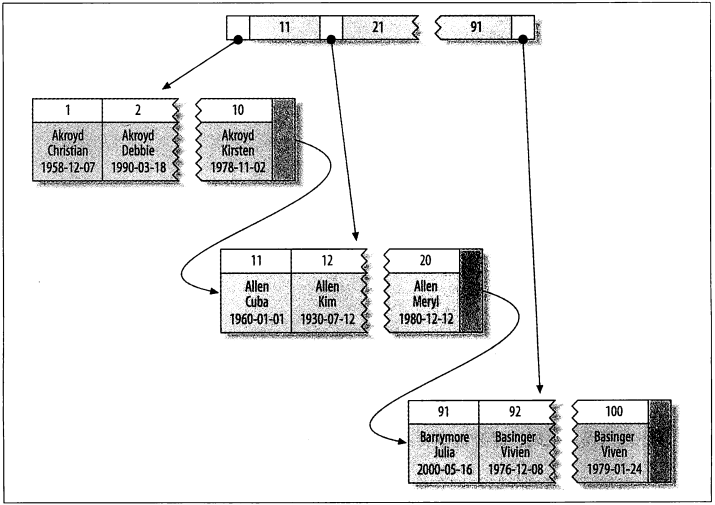

### Schema与数据类型优化

#### 选择优化的数据类型

1. 更小的通常更好：它们占用更少的磁盘、内存、CPU 缓存，并且处理时需要的 CPU 周期更少
2. 简单就好：简单数据类型的操作通常需要更少的 CPU 周期
3. 尽量避免 NULL：当 NULL 的列被索引时，每个索引记录需要一个额外的字节。尽量避免在 NULL 列上建立索引

#### 整数类型

有符号和无符号使用相同的存储空间，并具有相同的性能

整数计算一般使用 64 位 的 BIGINT 整数，即使在 32 位环境也是如此。（一些聚合函数除外，它们使用 DECIMAL 或 DOUBLE 进行计算）

#### 实数类型

FLOAT 和 DOUBLE 类型支持使用标准的浮点运算进行近似计算

DECIMAL　类型用于存储精确的小数，在 MySQL 5.0 和 更高的版本，DECIMAL 类型支持精确精确计算

浮点类型在存储同样范围的值时，通常比 DECIMAL 使用更少的空间

只对小数进行精确计算时候才使用 DECIMAL。但在数据量比较大的时候，可以考虑使用 BIGINT 代替DECIMAL，将需要存储的货币单位根据小数的位数乘以响应的倍数即可

#### 字符串类型

##### VARCAHR

VARCHAR 需要使用 1 或 2个额外字节记录字符串的长度；如果列的最大长度小于等于 255 ，则只使用 1 个字节表示，否则使用 2 个字节

VARCAHR 适合：字符串列的最大长度比平均长度大很多；列更新很少，所以碎片不是问题；使用了像 UTF-8 这样复杂的字符集，每个字符都使用不同的字节数进行存储

在 MySQL 5.0 或更高版本，MySQL 在存储和检索时会保留末尾空格。但在 4.1 或更老的版本，MySQL 会删除末尾空格

##### CAHR

CHAR 类型是定长的，当存储 CHAR 值时，MySQL 会删除所有的末尾空格。

CHAR 值会根据需要采取空格进行填充以方便比较，CHAR 适合存储很短的字符串，或者所有值都接近同一个长度

##### BLOB 和 TEXT 类型

MySQL 把每个 BLOB 和 TEXT 值当作一个独立的对象处理。存储引擎在存储时会做特殊处理。当 BLOB 和 TEXT 值太大时，InnoDB 会使用专门的 "外部" 存储区域来进行存储，此时每个值在行内需要 1- 4 个字节存储一个指针，然后再外部存储区域存储实际值

MySQL 在对 BLOB 和 TEXT 列排序时支队每个列最前 max_sort_length 字节排序

##### 使用枚举 ENUM 代替字符串类型

枚举列可以把一些不重复的字符串存储为一个预定的集合。MySQL 在存储枚举时非常紧凑，会根据列表值的数量压缩到一个或两个字节中。MySQL 在内部中会将每个值在列表中得位置保存为整数，并且在表得 .frm 文件中保存 "数字 - 字符串" 映射关系的查找表

枚举字段时按照内部存储的整数而不是定义的字符串进行排序

#### 日期和时间类型

MySQL 能存储得最小时间粒度为秒

DATETIME 能保存大范围得值，从 1001 到 9999 年，精度为秒。它把日期和时间封装到格式为 YYYYMMDDHHMMSS 的整数中，与时区无关。使用 8 个字节的存储空间

TIMESTAMP 保存了从 1970 年 1 月 1日午夜（格林尼治标准时间）以来的秒数，它只使用了 4 个字节的存储空间，只能表示从 1970 到 2038 年

除非特殊情况下，通常应该尽量使用 TIMESTAMP，因为它比 DATETIME 空间效率更高

### 范式与反范式

#### 范式

1. 第一范式（1NF）用来确保每列的原子性，要求每列（或者每个属性值）都是不可再分的最小数据单元
2. 第二范式（2NF）在第一范式的基础上更进一层，要求表中的每列都和主键相关，即要求实体的唯一性
3. 第三范式（3NF）在第二范式的基础上更进一层，第三范式是确保每列都和主键列直接相关，而不是间接相关，即限制列的冗余性

#### 范式的优缺点

1. 范式的更新操作通常比反范式化更快
2. 当数据较好地范式化时，就只有很少或者没有重复数据，所有只需要修改更少的数据
3. 范式化的表通常更小，可以更好地放在内存中，所以执行操作会更快
4. 很少有多余的数据意味着检索列表数据时更少需要 DISTINCT 或者 GROUP BY 语句

#### 反范式的优缺点

1. 反范式化的 schema 因为所有数据都在一张表中，可以很好的避免关联
2. 单独的表也能使用更有效的索引策略

### 加快 ALTER TABLE 的操作速度

#### 常见技巧：

1. 先在一台不提供服务的机器上执行 ALTER TABLE 操作，然后和提供服务的主库进行切换
2. 用要求的表结构创建一个与原表无关的新表，然后通过重命名和删表操作交换两张表

#### 只修改 .frm 文件

如下操作可能不需要重建表

1. 移除一个列的 AUTO_INCREMENT 属性
2. 增加、移除或更改 ENUM 和 SET 常量。如果移除的是已经有行数据用到其值的常量，查询将会返回一个空字符串

### 创建高性能的索引

#### 索引的类型

##### B-TREE 索引

B-TREE 通常意味着所有的值都是按顺序存储的，并且每一个叶子页到根的距离相同。

B-TREE 索引加快访问速度，因为存储引擎不再需要进行全表扫描来获取数据，而是从索引的根节点开始进行搜索。根节点中存放了指向子节点的指针，存储引擎根据这些指针向下层查找。

叶子节点比较特别，它们指针指向的是被索引的数据，而不是其他的节点页

**B-TREE 索引可以查询类型**

1. 全值匹配：和索引中的所有列进行匹配
2. 匹配最左前缀
3. 匹配列前缀：只匹配某一列值的开头部分
4. 匹配范围值
5. 精确匹配某一列并范围匹配另外一列
6. 只访问索引的查询


##### 哈希索引

基于哈希表实现，只有精确匹配索引所有列得查询才有效

哈希索引将所有的哈希码存储在索引中给，同时在哈希表中保存指向每个数据行的指针

哈希索引的限制：

1. 哈希索引只包含哈希值和行指针，而不存储字段值，所以不能使用索引中的值来避免读取行
2. 哈希索引数据并不是按照索引值顺序存储的，所以无法用于排序
3. 哈希索引不支持部分索引列匹配查询，因为哈希索引始终是使用索引列的全部内容来计算哈希值。
4. 哈希索引值支持等值查询，不支持范围查询
5. 哈希冲突很多的话，一些索引维护操作的代价很高

##### 聚簇索引

聚簇索引它的数据行实际上存放在叶子页中

聚簇表示数据行和相邻的键值紧凑的存储在一起



聚簇索引的优点：

1. 可以把相关数据保存在一起
2. 数据访问更快。聚簇索引将索引和数据保存在统一个 B-TREE 中，一次从聚簇索引中获取数据通常比非聚簇索引中查找更快
3. 使用覆盖所有扫描的查询可以直接使用页节点中的主键值

聚簇索引的缺点：

1. 聚簇索引最大限度的提高了 I/O 密集型应用的性能，但如果数据全部都放在内存中，则访问顺序就没有那么重要了，聚簇索引就没什么优势了
2. 插入速度严重依赖于插入顺序
3. 更新聚簇索引列的代价很高，因为会强制 InnoDB 将每个被更新的行移动到新的位置
4. 基于聚簇索引的表在插入新行，或者主键被更新导致需要移动行的时候，可能会面临页分裂问题
5. 聚簇索引可能导致全表扫描变慢，尤其是行比较稀疏或由于页分裂导致数据存储不连续的时候
6. 二级索引（非聚簇索引）可能比想象得要更大，因为二级索引得叶子节点包含了引用行的主键
7. 二级索引访问需要两次索引查找，而不是一次

#### 索引的优点

1. 索引大大减少了服务器需要扫描的数据量
2. 索引可以帮助服务器避免排序和临时表
3. 索引可以随机 I/O 变为顺序 I/O

#### 高性能的索引策略

##### 独立的列

指索引列不能是表达式的一部分，也不能是函数的参数

```sql
SELECT actor_id FROM actor WHERE actor_id + 1 = 5;
SELECT ... WHERE TODAYS(CURRENT_DATE) - TODAYS(date_col) <= 10;
```

##### 前缀索引和索引选择性

索引选择性指不重复的索引值和数据表的记录总数的比值，索引的选择性越高则查询效率越高。

一般情况下某个列前缀的选择性也足够高，对于 BLOB、TEXT 或者很长的 VARCHAR 类型的列，必须使用前缀索引。

绝对前缀的合适长度，需要找到最常见的值的列表，然后和最常见的前缀列表进行比较。也就是先统计出原列表中最常见值的列表，再截取前缀统计最常见前缀列表，若原列表和最常见前缀列表对比的值差距不大则是合适的数。

前缀索引缺点：

1. 无法使用前缀索引做 ORDER BY 和 GROUP BY，也无法使用前缀索引做覆盖扫描。

##### 多列索引

索引合并策略的缺点：

1. 当出现服务器多个索引做相交操作时(通常有多个 AND 条件)，通常意味着需要一个包含所有相关列的多列索引，而不是多个独立的单列索引
2. 当服务器需要对多个索引做联合操作时(通常有多个 OR 条件)，通常需要消耗大量 CPU 和 内存资源在算法的缓存、排序和合并操作上。特别是其中有些索引的选择性不高，需要合并扫描返回大量数据的时候

### InnoDB 和 MyISAM 的数据分布对比

#### MyISAM

MyISAM 按照数据插入的顺序存储在磁盘上，由于行是定长的，所有 MyISAM 可以从表的开头跳过所需的字节找到需要的行

 主键索引


二级索引


在 MyISAM 中主键索引和其他索引在结构上没有什么不同，主键索引就是一个名为 PRIMARY 的唯一非空索引

#### InnoDB

聚蔟索引


聚蔟索引的每一个叶子节点都包含了主键值，事务ID、用于事务和MVCC的回滚指针以及所有的剩余列。如果主键是一个列前缀索引，InnoDB也会包含完整的主键列和剩下的其他列

二级索引

InnoDB 二级索引的叶子节点中存储的不是行指针，而是主键值，并以此作为指向行的指针，这样的策略减少了当出现行移动或数据页分裂时索引的维护工作


InnoDB 和 MyISAM 保存数据的区别


##### InnoDB 表中按主键顺序插入行

自增列插入：主键的值是顺序的，所以 InnoDB 把每一条记录都存储在上一条记录的后面。当达到页的最大填充因子(默认是页大小的 15/16，留下部分空间用于以后修改)时，下一条数据就会写入新的页中。

UUID 插入：新行的主键值不一定比之前插入的大，所以 InnoDB 无法简单的总是把新行插入到索引最后，而是需要为新的行寻找合适的位置。

UUID 的缺点：

1. 写入的目标页可能已经刷到磁盘上并从缓存中移除，或者还没有加载到缓存中，InnoDB 在插入之前不得不先找到并从磁盘读取目标页到内存上
2. 因为写入时乱序的，InnoDB 不得不频繁做页的分裂操作，以便为新的行分配空间。页分裂会导致大量数据移动，一次插入最少需要修改三个页而不是一个页
3. 由于频繁的页分裂，页会变的稀疏并被不规则地填充，所以最终数据会有碎片

把这些随机值载入到聚蔟索引后，也需要做一次 OPTIMIZE TABLE 来重建表并优化页的填充

#### 覆盖索引

如果一个索引包含(或覆盖)所有查询需要的字段的值，我们就称之为覆盖索引

覆盖索引好处：

1. 索引条目通常远小于数据行大小，所有如果只需要读取索引，那 MySQL 就会极大地减少数据访问量
2. 因为索引是按照列值顺序存储的（至少在单个页内如此），所以对于 I/O 密集型的范围查询会比随机从磁盘读取每一行数据的I/O要少得多
3. 一些存储引擎（如MyISAM）在内存中只缓存索引，数据则依赖于操作系统来缓存，因此要访问数据需要一次数据调用。这可能会导致严重的性能问题，尤其是那些系统调用占了数据访问中的最大开销的场景
4. InnoDB 的二级索引在叶子节点中保存了行的主键值，所以二级主键能覆盖查询，则可以避免对主键索引的二次查询

MySQL 只能使用 B-TREE 索引做覆盖索引，而哈希索引、空间索引和全文索引等都不存储索引列的值，索引不能做覆盖索引

#### 使用索引扫描来做排序

MySQL 两种生成有序的结果：通过排序操作；按索引顺序扫描。如果 EXPLAIN 出来的 type 列的值为 index，则说明 MySQL 使用了索引扫描来做排序

只有当索引的列顺序和 ORDER BY 子句的顺序完全一致，并且所有列的排序方向（倒序或正序）都一样时，MySQL 才能使用索引来对结果做排序

如果查询需要关联多张表，则只有当 ORDER BY 子句引用的字段全部为第一张表时，能才使用索引做排序。当前列值为常量时候，ORDER BY 子句可以不满足索引的最左前缀要求

#### 冗余和重复索引

重复索引是指在相同的列上按照相同的顺序创建的相同类型的索引。应该避免这样创建重复索引，发现后应移除

大多数 情况下都不需要冗余索引，应该尽量扩展已有的索引而不是创建新的索引

#### 索引和锁

InnoDB 只有在访问行的时候才会对其加锁，而索引能够减少 InnoDB 访问行数，从而减少锁的数量。

InnoDB 在二级索引上使用共享锁，但访问主键索引需要排他锁。这消除了使用覆盖索引的可能性。并且使得 SELECT FOR UPDATE 比 LOCK IN SHARE MODE 或非锁定查询要慢很多

#### 索引使用案例

1. 支持拥有多种过滤条件
2. 避免多个范围条件：范围条件查询，MySQL 无法再使用范围列后面的其他索引列了

#### 数据碎片化

数据碎片化的类型：

1. 行碎片：数据行被存储为多个地方的多个片段
2. 行间碎片：逻辑上顺序的页，或者行在磁盘上不是顺序存储的
3. 剩余空间碎片：数据页中有大量的空余空间 

碎片化处理：

1. 可以通过执行 OPTIMIZE TABLE 或者导出再导入的方式来重新整理数据

2. MyISAM 可以通过排序算法重建索引的方式来消除碎片

3. InnoDB 可以通过先删除，再重新创建索引的方式来消除索引碎片

4. 对于不支持 OPTIMIZE TABLE 的存储引擎，可以通过 ALTER TABLE 将表的存储引擎改为当前的引擎

### 查询性能优化

#### 优化数据访问

**请求不需要的数据：**

1. 查询不需要的记录：误以为 MySQL 只会返回需要的数据，但是先返回全部结果集合再进行计算
2. 多表关联时返回全部列
3. 总是取出全部列：会让优化器无法完成索引覆盖扫描这类优化，还会为服务器带来额外的 I/O、内存和 CPU 消耗
4. 重复查询相同的数据

**MySQL 使用 WHERE 条件的三种方式：**

1. 在索引中使用 WHERE 条件来过滤不匹配的记录，这是在存储引擎完成的
2. 使用索引覆盖扫描来返回记录，直接从索引中过滤不需要的记录并返回命中的结果
3. 从数据表中返回数据，然后过滤不满足条件的记录

**查询需要扫描大量数据但返回少数行的优化技巧：**

1. 使用索引覆盖扫描，把所有需要用到的列到放到索引中，这样存储引擎无须回表获取对应行就可以返回结果
2. 改变库表结果，例如使用单独的汇总表
3. 重写这个复杂查询

#### 重构查询方式

1. 一个复杂查询分成多个简单查询
2. 切分查询: 将大查询切分成小查询，每个查询功能完全一样，只完成一小部分，每次只返回一小部分查询结果
3. 分解关联查询

分解关联查询优势：

- 让缓存的效率更高
- 查询分解后，执行单个查询可以减少锁的竞争
- 在应用层关联，可以更容易对数据库进行拆分，更容易做到高性能和可扩展
- 查询本身效率也可能会有提升
- 可以减少冗余记录的查询

#### 查询执行的基础


1. 客户端发送一条查询给服务器
2. 服务器先检查查询缓存，如果命中，则立即返回存储在缓存中的结果，否则进入下一阶段
3. 服务器端进行 SQL 解析、预处理，再由优化器生成对应的执行计划
4. MySQL 根据优化器生成的执行计划，调用存储引擎的 API 来执行查询
5. 将结果返回给客户端

##### 查询状态

- Sleep：线程正在等待客户端发送新的请求
- Query：线程正在执行查询或者正在将结果发送给客户端
- Locked：在 MySQL 服务层，该线程正在等待表锁
- Analyzing and statistics：线程正在收集存储引擎的统计信息，并生成查询的执行计划
- Copying to tmp table [on disk]：线程正在执行查询，并且将其结果集都复制到一个临时表中，这种状态要么是在做 GROUP BY 操作，要么是文件排序操作，或者是 UNION 操作。如果这个状态后面还有 on disk 标记，那标识 MySQL 正在将一个内存临时表放在磁盘上

- Sorting result：线程正在对结果集进行排序
- Sending data：线程可能在多个状态之间传送数据；生成结果集；向客户端返回数据

#### 查询优化处理

##### 语法解析器和预处理

1. MySQL  通过关键字将 SQL 语句进解析，并生成一颗对应的 "解析树"。MySQL 解析器将使用 MySQL 语法规则验证和解析查询

2. 预处理器则根据 MySQL 规则进一步检查解析树是否合法，例如检查数据表和数据列是否存在等

3. 预处理会验证权限

##### 查询优化器

MySQL 是基于成本的优化器，它将尝试预测一个查询使用某种执行计划时的成本，并选择其中成本最小的一个

```sql
-- 查询当前会话的 Last_query_cost 值来得知 MySQL 计算的当前查询的成本
SHOW STATUS LIKE ’Last_query_cost‘
```

导致优化器选择错误执行计划的原因：

1. 统计信息不准备
2. 执行计划中的成本估算不等同于实际执行的成本
3. MySQL 的最优可能和你想的最优不一样
4. MySQL 从不考虑其他并发执行的查询
5. MySQL 也并不是任何时候都基于成本的优化
6. MySQL 不会考虑不受其控制的操作的成本
7. 优化器有时候无法估算所有可能的执行计划

MySQL 能处理的优化类型：

1. 重新定义关联表的顺序
2. 将外连接转换成内连接
3. 使用等价变换规则
4. 优化 COUNT()、MIN() 和 MAX()：索引和列是否可为空可以帮助 MySQL 优化这类表达式
5. 预估并转换为常数表达式
6. 覆盖索引扫描
7. 子查询优化
8. 提前终止查询
9. 等值传播
10. 列表 IN() 的比较

##### 执行计划

MySQL 生成查询的一颗指令树，然后通过存储引擎执行完这颗指令树并返回结果。


#### 排序优化

需要排序的数据量小于排序缓冲区，MySQL 使用内存进行快速排序。如果内存不够排序，那么 MySQL 会先将数据分块，对每个独立的块使用快速排序进行排序，并将各个块的排序结果存放在磁盘上，然后将各个排好序的块进行合并

MySQL 中有两种排序算法

1. 两次传输排序：读取行指针和需要排序的字段，对其进行排序，然后再根据排序结果读取所需要的数据行
2. 单次传输排序：先读取查询所需要的所有列，然后再根据给定的列进行排序，最后直接返回结果

#### 查询执行引擎

MySQL 查询执行引擎根据执行计划给出的指令逐步执行完成整个查询

MySQL 在优化阶段为每个表创建一个 handler 实例，优化器根据这些实例的接口可以获取表的相关信息，包括表的所有列名、所有统计信息等

#### 返回结果给客户端

MySQL 将结果集返回客户端是一个增量、逐步返回的过程。这样处理服务端无须存储太多的结果，也就不会因为要返回太多的结果导致内存消耗太大。也可以使 MySQL 客户端第一时间获得返回的结果