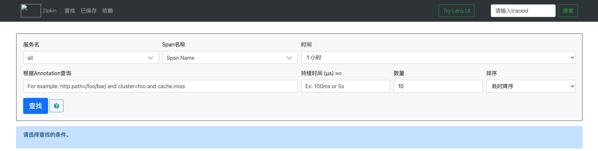
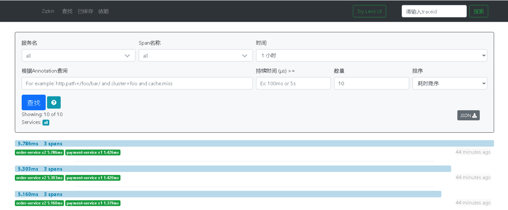

## SpringCloud Sleuth

### 链路监控搭建

#### zipkin

SpringCloud 从 F 版本开始不需要搭建 zipkin-server，只需下载 jar 并运行即可

下载地址（下载 zipkin-server-版本号-exec.jar）：

> https://dl.bintray.com/openzipkin/maven/io/zipkin/java/zipkin-server/

服务启动

```shell
java -jar zipkin-server-版本号-exec.jar
```

访问

> http://localhost:9411/zipkin/



### 基本概念

**Span**：基本工作单位。例如，发送RPC是新的Span，就像发送响应到RPC一样。Span还具有其他数据，例如描述，带有时间戳的事件，键值注释（标签）。

跨度可以启动和停止，并且可以跟踪其时序信息。创建跨度后，您必须在将来的某个时间点将其停止。

**Trace：**形成树状结构的一组 Span。例如，如果您运行分布式大数据存储，则跟踪可能是由`PUT`请求形成的。

**如下图则是整个的流程**：

整个链路通过 Trace id 唯一标识，Span 标识发起的请求信息，各Span 通过 parent id 进行关联


### 项目搭建

#### 服务提供者

增加 Zipkin 依赖（其中已经集成了 Sleuth）

```xml
<dependency>
		<groupId>org.springframework.cloud</groupId>
		<artifactId>spring-cloud-starter-zipkin</artifactId>
</dependency>
```

增加配置

```yaml
spring:
  zipkin:
    base-url: http://localhost:9411
  sleuth:
    sampler:
      # 采样率介于 0 到 1 之间，1 则表示全部采集
      probability: 1
```

#### 服务消费者

增加 zipkin 依赖

```xml
<dependency>
		<groupId>org.springframework.cloud</groupId>
		<artifactId>spring-cloud-starter-zipkin</artifactId>
</dependency>
```

增加配置

```yaml
spring:
  zipkin:
    base-url: http://localhost:9411
  sleuth:
    sampler:
      # 采样率介于 0 到 1 之间，1 则表示全部采集
      probability: 1
```

#### 测试

调用接口后会在界面会有如下显示



#### 持久化处理

**持久化到 MySQL**

创建数据表

```sql
CREATE TABLE IF NOT EXISTS zipkin_spans (
  `trace_id_high` BIGINT NOT NULL DEFAULT 0 COMMENT 'If non zero, this means the trace uses 128 bit traceIds instead of 64 bit',
  `trace_id` BIGINT NOT NULL,
  `id` BIGINT NOT NULL,
  `name` VARCHAR(255) NOT NULL,
  `remote_service_name` VARCHAR(255),
  `parent_id` BIGINT,
  `debug` BIT(1),
  `start_ts` BIGINT COMMENT 'Span.timestamp(): epoch micros used for endTs query and to implement TTL',
  `duration` BIGINT COMMENT 'Span.duration(): micros used for minDuration and maxDuration query',
  PRIMARY KEY (`trace_id_high`, `trace_id`, `id`)
) ENGINE=InnoDB ROW_FORMAT=COMPRESSED CHARACTER SET=utf8 COLLATE utf8_general_ci;

ALTER TABLE zipkin_spans ADD INDEX(`trace_id_high`, `trace_id`) COMMENT 'for getTracesByIds';
ALTER TABLE zipkin_spans ADD INDEX(`name`) COMMENT 'for getTraces and getSpanNames';
ALTER TABLE zipkin_spans ADD INDEX(`remote_service_name`) COMMENT 'for getTraces and getRemoteServiceNames';
ALTER TABLE zipkin_spans ADD INDEX(`start_ts`) COMMENT 'for getTraces ordering and range';

CREATE TABLE IF NOT EXISTS zipkin_annotations (
  `trace_id_high` BIGINT NOT NULL DEFAULT 0 COMMENT 'If non zero, this means the trace uses 128 bit traceIds instead of 64 bit',
  `trace_id` BIGINT NOT NULL COMMENT 'coincides with zipkin_spans.trace_id',
  `span_id` BIGINT NOT NULL COMMENT 'coincides with zipkin_spans.id',
  `a_key` VARCHAR(255) NOT NULL COMMENT 'BinaryAnnotation.key or Annotation.value if type == -1',
  `a_value` BLOB COMMENT 'BinaryAnnotation.value(), which must be smaller than 64KB',
  `a_type` INT NOT NULL COMMENT 'BinaryAnnotation.type() or -1 if Annotation',
  `a_timestamp` BIGINT COMMENT 'Used to implement TTL; Annotation.timestamp or zipkin_spans.timestamp',
  `endpoint_ipv4` INT COMMENT 'Null when Binary/Annotation.endpoint is null',
  `endpoint_ipv6` BINARY(16) COMMENT 'Null when Binary/Annotation.endpoint is null, or no IPv6 address',
  `endpoint_port` SMALLINT COMMENT 'Null when Binary/Annotation.endpoint is null',
  `endpoint_service_name` VARCHAR(255) COMMENT 'Null when Binary/Annotation.endpoint is null'
) ENGINE=InnoDB ROW_FORMAT=COMPRESSED CHARACTER SET=utf8 COLLATE utf8_general_ci;

ALTER TABLE zipkin_annotations ADD UNIQUE KEY(`trace_id_high`, `trace_id`, `span_id`, `a_key`, `a_timestamp`) COMMENT 'Ignore insert on duplicate';
ALTER TABLE zipkin_annotations ADD INDEX(`trace_id_high`, `trace_id`, `span_id`) COMMENT 'for joining with zipkin_spans';
ALTER TABLE zipkin_annotations ADD INDEX(`trace_id_high`, `trace_id`) COMMENT 'for getTraces/ByIds';
ALTER TABLE zipkin_annotations ADD INDEX(`endpoint_service_name`) COMMENT 'for getTraces and getServiceNames';
ALTER TABLE zipkin_annotations ADD INDEX(`a_type`) COMMENT 'for getTraces and autocomplete values';
ALTER TABLE zipkin_annotations ADD INDEX(`a_key`) COMMENT 'for getTraces and autocomplete values';
ALTER TABLE zipkin_annotations ADD INDEX(`trace_id`, `span_id`, `a_key`) COMMENT 'for dependencies job';

CREATE TABLE IF NOT EXISTS zipkin_dependencies (
  `day` DATE NOT NULL,
  `parent` VARCHAR(255) NOT NULL,
  `child` VARCHAR(255) NOT NULL,
  `call_count` BIGINT,
  `error_count` BIGINT,
  PRIMARY KEY (`day`, `parent`, `child`)
) ENGINE=InnoDB ROW_FORMAT=COMPRESSED CHARACTER SET=utf8 COLLATE utf8_general_ci;

```

启动时指定 mysql 信息

```shell
java -jar zipkin-server-2.12.9-exec.jar --STORAGE_TYPE=mysql --MYSQL_HOST=127.0.0.1 --MYSQL_TCP_PORT=3306 --MYSQL_DB=zipkin --MYSQL_USER=root --MYSQL_PASS=123456
```

**持久化 ES**

启动参数加入 es 配置即可

```shell
java -jar zipkin-server-2.12.9-exec.jar --STORAGE_TYPE=elasticsearch --ES-HOST=localhost:9200
```


